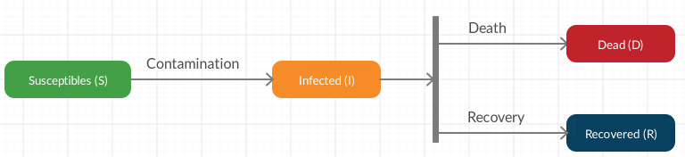

# Introduction

## Context Summary
The COVID-19 is infecting many hundred of thousands people in the world and is very virulant. Among these people, many recovered from the infection while some of them died. These statistics increase day after day and many scientists are working to understand the virus and find out a vaccin to stop the propagation. While the COVID-19 is propagating around the world, safety measures have been enforced in many countries in order to reduce the propagation between infected people and non infected people. However, they discovered that elder people and people with chronic diseases are more at risk to die.

Here are some safety measures applied in Canada:

- Social distancing rule where people have to be at a distance of at least 2 meters between each other. People that are not respecting that rule could get a fine (from 1500\$ to 6000\$). It also means that gatherings of people are strongly forbidden and is punishable by fine.
- Non-essential services and stores are closed. Services like hospitals, police, gaz stations, drug stores, grocery stores are considered essential services and stores.
- There is a limitation of people that can enter the stores considered as essential. Also, people have to wash their hands with purell when entering the store. In grocery stores, baskets are all desinfected once a client finished his grocery and leave the store.
- Since July 18th, 2020, people must wear a mask to cover their mouth and nose in all closed public areas (e.g. stores, banks, gaz station).


## Problem and Questions
The COVID-19 is not fully understood and many thousands of people are getting infected and die day after day. Some safety measures are in place in many countries, but other problems of psychologic nature may arise from these measures. Are those safety measures really as efficient as we thought? We would say yes because it seems to be the common sense for many people to reduce the propagation. However, other factors might be important to consider and might have more impacts on the propagation than we may think.  

Since the virus is not fully understood, many questions have to be answered. Here are some of these questions: 

1. In which countries the propagation of the virus slowed down the most quickly?
2. Which countries have the greater ratio of deaths over the population and the total infected people?
3. Which countries have the greater ratio of recovery over the population and the total infected people?
4. What is the age category that is more susceptible to die from the COVID-19 after being infected?
5. What is the age category that got mostly infected.
6. Is there a correlation between the sex of a person and the infection rate, death rate and recovery rate?
7. Which chronic diseases are the most vulnerable against the COVID-19?
8. Does the weather have an impact on the COVID-19 propagation?
9. Do the pollution rates have an impact on the COVID-19 propagation?
10. Does the hospitals capacity have an impact on the number of deaths caused by the COVID-19? Which countries are mostly impacted?
11. Is there a correlation between the density of the population and the propagation velocity of the COVID-19?


## Objective
The objective of this analysis is to understand the propagation of the COVID-19 in countries and more precisely in Canada and in the province of Québec. It means to identify factors that appear to impact the propagation velocity of the COVID-19. Understanding these factors will help to understand the propagation of the virus and know how to slow it down quicker.


# Data Preparation
The objective is to gather necessary data in order to answer our questions. The following datasets are used in our analysis:

- [Total population by country](http://api.worldbank.org/v2/en/indicator/SP.POP.TOTL);
- [Worldwide Covid-19 cases](https://github.com/CSSEGISandData/COVID-19/tree/master/csse_covid_19_data/csse_covid_19_time_series) prepared by the John Hopkins University Center for Systems Science and Engineering.

The dataset shared by the John Hopkins University Center for Systems Science and Engineering provides the information on the:

- Country or region
- Province or state for some countries
- Latitude
- Longitude
- Date
- Cummulative number of people confirmed with the COVID-19
- Cummulative number of people that died from the COVID-19
- Cummulative number of people that recovered from the COVID-19

```{r echo=FALSE, message=FALSE, warning=FALSE, comment=NA}
source("Source/DataPreparation.R")
source("Source/DataExploration.R")
source("Source/Model.R")

set.seed(1234)

## Remove scientific notation (e.g. E-005).
options(scipen = 999)

## Set the title of all charts in the middle.
theme_update(plot.title = element_text(hjust = 0.5))


dataset <- GetPreparedDataset()
date.list <- unique(as.character(dataset$Date))

countries.total <- length(unique(dataset$Country.Region))
date.start <- date.list[1]
date.end <- tail(date.list, n=1)

cat("Number of countries or regions: ", countries.total, "\n")
cat("Start date: ", date.start, "\n")
cat("End date: ", date.end, "\n\n\n")
```


# Dataset Exploration


## Worldwide Propagation


### Daily Progression
The objective is to know the distribution of the number of people infected, dead and that recovered from the COVID-19 over days in the world.

```{r echo=FALSE, message=FALSE, warning=FALSE, comment=NA}
progression.overall <- GetWorldProgression(dataset)
knitr::kable(tail(progression.overall, n = 14), row.names = FALSE)
Scatter.ShowProgression(progression.overall)

state.total <- GetTotalPerCountryState(dataset)
country.total <- GetTotalPerCountry(state.total)

infected.total <- sum(country.total$Total.Infected)
deaths.total <- sum(country.total$Total.Deaths)
recovered.total <- sum(country.total$Total.Recovered)
infected.active.total <- infected.total - deaths.total - recovered.total

world.overall <- data.frame(State.Names = c("Deaths", "Recovered", "Active Infected"),
                            Total = c(deaths.total, recovered.total, infected.active.total))
PieChart.ShowPercentageOverCumulativeInfected(world.overall, infected.total)
```

The distribution of the number of people infected, dead or recovered seems to be exponential. This would make sense because if we assume that all people will be infected one day or another, we expect that the curve will describe a sigmoid curve. The reasons behind this is explained in the **Propagation Model section**.


### Countries With Highest Number of People Infected
The objective is to show in which countries there are the most infected people until today. Since there are many countries and because the list may be huge enough, we only display the 20 countries with the greatest number of infected people.

```{r echo=FALSE, message=FALSE, warning=FALSE, comment=NA}
knitr::kable(head(country.total, n=25))
BarChart.ShowTotalByCountry(head(country.total[, c("Country.Region", "Total.Recovered", "Total.Deaths", "Total.Infected.Active")], n=20))
```


### Countries Worst Ratio of Infected and Death People
The objective is to know which countries have the worst ratio of deaths and infected people over their population.

```{r echo=FALSE, message=FALSE, warning=FALSE, comment=NA}
country.total <- AddPopulationToDataset(country.total)
country.total.percentages <- GetPercentageOf(country.total)

country.total.percentages.infected <- head(country.total.percentages[, c("Country.Region", "Population", "Percent.Infected")] %>% arrange(desc(Percent.Infected)), n = 20)
knitr::kable(country.total.percentages.infected)
BarChart.ShowPercentOverPopulation(country.total.percentages.infected[, c("Country.Region", "Percent.Infected")])

country.total.percentages.deaths <- head(country.total.percentages[, c("Country.Region", "Population", "Percent.Deaths")] %>% arrange(desc(Percent.Deaths)), n = 20)
knitr::kable(country.total.percentages.deaths)
BarChart.ShowPercentOverPopulation(country.total.percentages.deaths[, c("Country.Region", "Percent.Deaths")])
```


### Countries Worst Ratio of Deaths Over Cumulative Infected People
The objective is to know which countries (top 20) have the worst ratio of dead people over the cumulative infected people.

```{r echo=FALSE, message=FALSE, warning=FALSE, comment=NA}
country.percent <- head(GetCountriesWithWorstPercentageOfDeathsOverInfected(country.total[, c("Country.Region", "Total.Infected", "Total.Deaths")]), n=20)
knitr::kable(country.percent)
BarChart.ShowPercentOverPopulation(country.percent[, c("Country.Region", "Percent.Deaths")])
```


### Countries Best Ratio of Recovers Over Cumulative Infected People
The objective is to know which countries (top 20) have the best ratio of recovered people over the cumulative infected people.

```{r echo=FALSE, message=FALSE, warning=FALSE, comment=NA}
country.percent <- head(GetCountriesWithBestPercentageOfRecoveredOverInfected(country.total[, c("Country.Region", "Total.Infected", "Total.Recovered")]), n=20)
knitr::kable(country.percent)
BarChart.ShowPercentOverPopulation(country.percent[, c("Country.Region", "Percent.Recovered")])
```


## Countries With Stable or Decreasing Propagation
The objective is to identify all countries whose propagation is stable or decreasing. In order to find these countries, we have to define what precisely is the meaning of _stable_ or _decreasing_ propagation. 

Let $I(t)$ be the cumulative number of infected people at day $t \in \mathbb{N}$. If we take the difference between $I(t)$ at day $t$ and $t+1$, we get the **propagation velocity**. In mathematical terms, it is expressed as
$$
\Delta I(t) = \frac{I(t + 1) - I(t)}{(t+1) - t} = I(t + 1) - I(t)
$$
which can be seen as the derivative of $I(t)$ but in a discrete case. The same method is used to define the **propagation acceleration** where we look at the difference between the propagation velocity at day $t$ and $t+1$ expressed as
$$
\Delta^2 I(t) = \frac{\Delta I(t + 1) - \Delta I(t)}{(t+1) - t} = \Delta I(t + 1) - \Delta I(t) = I(t+2) - 2I(t+1) + I(t).
$$

The propagation is said **stable** if and only if the acceleration or deceleration is negligible which means that $\Delta^2 I(t) \approx 0$. Therefore, we need to find countries whose propagation acceleration is $\Delta^2 I(t) \lesssim 0$. However, some of the values of $I(t)$ contained in the dataset may be aberrant values. The first step is to determine and remove those aberrant values. The second step is to determine when the propagation is accelerating, stabilized and decelering.

```{r echo=FALSE, message=FALSE, warning=FALSE, comment=NA}
country.progression <- GetCountryProgression(dataset, country = "Canada")
infected.delta <- GetCountryFeatureDeltaBetweenDays(country.progression$Total.Infected)
country.progression <- cbind(country.progression, infected.delta)

infected.acceleration <- GetCountryFeatureDeltaBetweenDays(infected.delta)
country.progression <- cbind(country.progression, infected.acceleration)

knitr::kable(tail(country.progression[, c("Date", "Total.Infected", "infected.delta", "infected.acceleration")], n=14), row.names = FALSE)
Scatter.ShowCountryDeltaProgression(country.progression, "infected.acceleration")

infected.acceleration.mean <- mean(infected.acceleration)
infected.acceleration.var <- var(infected.acceleration)
infected.acceleration.sd <- sd(infected.acceleration)
```

It comes now the following questions:

1. What are the conditions to determine that a propagation velocity $\Delta I(t)$ is categorized as an aberrant value?
2. What is the range of propagation accelerations considerated as approximative to 0 in the expression $\Delta^2 I(t) \approx 0$ and how to determine it?


### Aberrant Propagation Acceleration Detection Model
The objective is to define what is an aberrant value based on our context. An aberrant value is a value that seems to be out of the "normality" according to the context. For example, if $\Delta^2 (t)$ oscillates normally between $-250$ and $300$ and at a day $k$, $\Delta^2 (k) = 1500$, then $\Delta^2 (k)$ could be considered as an aberrant value. It could be because they forgot to enter all the data received and compensate the day after by adding the current data plus the previous forgotten one.  

Since we want to find when the propagation speed is stable or is decreasing over days, the _value_ here is the propagation acceleration. Assuming that the propagation accelerations are independent and identically distributed (i.i.d.) between days, the idea is to assume that the propagation accelaration is normally distributed (equivalently $\Delta^2 I(t) \sim N(\mu, \sigma^2)$). The mean $\mu$ is expressed as 
$$
\mu = \frac{1}{n-2} \sum_{t = 1}^{n - 2} \Delta^2 I(t)
$$
where $n$ is the number of observations in the dataset. Because there are $n$ observations in the dataset, it follows that there are $n-2$ propagation accelerations. The variance is expressed as
$$
\sigma^2 = \frac{1}{n-2} \sum_{t = 1}^{n-2} (\Delta^2 I(t) - \mu)^2.
$$
Let's take the data of the Canada as an example. The mean of the propagation accelerations is $\mu = `r infected.acceleration.mean`$ and the variance is $\sigma^2 = `r infected.acceleration.var`$. Therefore, we have $\Delta^2 I(t) \sim N(`r infected.acceleration.mean`, `r infected.acceleration.var`)$ where the positive standard deviation is $\sigma = `r infected.acceleration.sd`$.

Therefore, the propagation acceleration is **aberrant** if and only if 
$$
\Delta^2 I(t) \in ]-\infty, \mu - k\sigma] \cup [\mu + k\sigma, \infty[.
$$
where $k \in \mathbb{R}$ is the parameter to provide. For example, if $k = 2$, non-aberrant propagation accelerations in the Canada have to be exclusively between 2 standard deviations `r infected.acceleration.mean - 2*infected.acceleration.sd` and `r infected.acceleration.mean + 2*infected.acceleration.sd`.

```{r echo=FALSE, message=FALSE, warning=FALSE, comment=NA}
lower_bound <- infected.acceleration.mean - 2*infected.acceleration.sd
upper_bound <- infected.acceleration.mean + 2*infected.acceleration.sd

infected.acceleration <- data.frame(Date = country.progression$Date,
                                    Acceleration = infected.acceleration)
non_aberrant <- infected.acceleration[infected.acceleration$Acceleration >= lower_bound & infected.acceleration$Acceleration <= upper_bound, ]
```

Actually, there are `r (1 - nrow(non_aberrant) / nrow(infected.acceleration)) * 100` % of the propagation accelerations that are aberrant.

```{r echo=FALSE, message=FALSE, warning=FALSE, comment=NA}
#Scatter.ShowCountryDeltaProgression(non_aberrant, "Acceleration")
```


### Propagation Phases Model
We know that a propagation can accelerate, become stable and decelerate on its curve. The objective is to find a model that determines if the propagation is still accelerating, stabilized or decelering based on a set of points chronologically ordered. The idea is to find the global maximum among the non-aberrant propagation accelerations and define what is considered as an acceleration, a stabilization and a deceleration on the curve.

We define a **propagation cycle** when the 3 propagation phases occur in this order: Acceleration, Stabilization and Deceleration. We saw that a propagation is stable if $\Delta^2(t) \approx 0$. This is equivalent to say that a propagation is **stable** if and only if
$$
|\Delta^2(t)| < \epsilon
$$
where $\epsilon \in \mathbb{N}_*$. The stabilization phase may take many days and for this reason, we have to extend this definition to $|\Delta^2(t + k)| < \epsilon$ where $t + k \leq n$. However, this is not enough because it may happen that, between days $t$ and $t+k$, the propagation is not stable. But overall, the bar chart will show that the propagation is stable. Therefore, we have to consider that a propagation is stable if the average of accelerations within a range of $k$ days is near 0. In other terms, the **propagation is stable** between days $t$ and $t + k$ if and only if
$$
|\mu(\Delta^2(t), k)| = \frac{1}{k} \left| \sum\limits_{i = 1}^k \Delta^2 (t + i)\right| < \epsilon.
$$

We define the **propagation acceleration** as an acceleration of the number of infected people between day $t$ and day $t + k$. The same method as the stabilization is used:
$$
\mu(\Delta^2(t), k) = \frac{1}{k} \sum\limits_{i = 1}^k \Delta^2 (t + i) \geq \epsilon.
$$
We define the **propagation deceleration** as a deceleration of the number of infected people between day $t$ and day $t + k$. The same method as the acceleration is used:
$$
\mu(\Delta^2(t), k) = \frac{1}{k} \sum\limits_{i = 1}^k \Delta^2 (t + i) \leq -\epsilon.
$$
It follows that we have to provide the following parameters: 

- the stabilization upper bound $\epsilon$;
- the number of days $k$ on which the mean $\mu(\Delta^2(t), k)$ will be calculated.
- The step of days $s$ between the calculation of means.


## Canada Propagation Overview
The objective is to know the overall propagation in Canada.

```{r echo=FALSE, message=FALSE, warning=FALSE, comment=NA}
deaths.delta <- GetCountryFeatureDeltaBetweenDays(country.progression$Total.Deaths)
country.progression <- cbind(country.progression, deaths.delta)
recovered.delta <- GetCountryFeatureDeltaBetweenDays(country.progression$Total.Recovered)
country.progression <- cbind(country.progression, recovered.delta)

knitr::kable(tail(country.progression[, !colnames(country.progression) %in% c("infected.acceleration")], n=14), row.names = FALSE)

Scatter.ShowProgression(country.progression[, c("Date", "Total.Infected", "Total.Deaths", "Total.Recovered")])
Scatter.ShowCountryDeltaProgression(country.progression, "infected.delta")


infected.total <- tail(country.progression$Total.Infected, n=1)
deaths.total <- tail(country.progression$Total.Deaths, n=1)
recovered.total <- tail(country.progression$Total.Recovered, n=1)
infected.active.total <- infected.total - deaths.total - recovered.total
canada.overall <- data.frame(State.Names = c("Deaths", "Recovered", "Active Infected"),
                            Total = c(deaths.total, recovered.total, infected.active.total))
PieChart.ShowPercentageOverCumulativeInfected(canada.overall, infected.total)
```


# Propagation Model
The COVID-19 is currently a worldwide pandemic virus which is considered very virulant. It means that it propagate from infected people to non-infected people by direct or indirect contacts. For exemple, if an infected person touches an object, a non-infected person touching the same object after a short time is mostly at risk to be infected.

The objective is to define a model that represents the propagation of the COVID-19 based on assumptions. However, we should take a look on variables that could have an impact on the propagation of the virus. Here is a list of some of those variables:

1. *Population density*: Countries with high population density should be more at risk because the contact between people is much easier hence more at risk to propagate the virus.

2. *Age of people*: Elder people are mostly to die after being infected by the virus because they are more fragile than younger people.

3. *People with chronic diseases*: People with chronic diseases like heart disease, lung disease, kidney disease, cancer, Alzheimer, diabetes, asthma and many others are more at risk to die after being infected.

4. *Births and deaths*: Since the propagation of the virus is a long time period, during this peiod, some people will die from any other causes than the COVID-19 which will decrease the population. In the other case, some women will give birth which will increase the population. 

5. *Safety measures*: During the pandemic, many countries adopted safety measures in order to help reducing the contamination between people. 

6. *Number of COVID-19 tests*: Since these tests are expensive, they are limited. Coutries that are part of the third world coutries will have less tests than the other countries. Therefore, the number of tests should at least be function of the country.

7. *Number of infected people not tested*: Some people that want to be tested because they might be infected by the COVID-19 are not tested because they are not considered as _essential_. By essential, we mean that the probability they infect others is much greater than other people that do not interact with people in their work (examples of essential people: police officers, nurses, docters). Other people could be infected and prefer to stay at home without asking to be tested.

8. *Infected error factor*: It may happen that a person has been tested positive to the COVID-19 but is not infected at all. Thus, errors when testing could happen. 

9. *Recovery error factor*: Errors could happen when people are considered to have recovered but in fact, they did not recover yet. They identified them as recovered too soon. 

10. *Death error factor*: It may happen that a person has not died from the COVID-19 but is counted as being dead because of the COVID-19.

We did not consider the immunity against the COVID-19 because we are incertain if there are people that will never be infected by the COVID-19 because they are immune. The same incertainty holds for people recovering from the COVID-19. We do not know if they are immune for the rest of their life or it is like the Influenza; they can be infected after a period of time (virus mutation for example).


## States and Transitions
A person can be in one of the following states during the propagation:

- Susceptible (noted $S(t)$): People susceptible to be infected by the COVID-19 at day $t$.
- Infected (noted $I_a(t)$): People tested positive to the COVID-19 at day $t$ but did neither recovered nor died yet.
- Dead (noted $D(t)$): People died from the COVID-19 at day $t$.
- Recovered (noted $R(t)$): People recovered from the COVID-19 at day $t$.

Initially, all people in the population are in the _Susceptible_ state. Then, it needs at least one person to start the propagation of the virus. This starts at day 1 (`r head(dataset$Date, 1)`) given in our dataset and ends actually on `r tail(dataset$Date, 1)`.

Here is a state diagram describing the interaction between the states:
```{r pressure, echo=FALSE, out.width = '100%'}

```

The arrows between the states represent the transitions between 2 states. 


## Assumptions
The following assumptions are made to simplify the model:

1. A person taken randomly in the population has the same probabilities to be infected than any other person taken randomly in the population (it follows a uniform distribution). Therefore, any people have the same probabilities (homogenous population) to be infected without considering their age or if they have a chronical diseases.

2. An infected person could stay infected, recover or die the next day. There is no error made when a person is categorized as infected by the COVID-19. It means that it is not possible for a person to be in the _Infected_ state and then transits back to the _Susceptible_ state because an error has been made.

3. Every person that recovers from the COVID-19 are immune against it. It means that once a person recovered, that person cannot be infected anymore. Therefore, there is no transition between the _Recovered_ state and the _Susceptible_ state or _Infected_ state.

4. During the propagation of the virus, there are neither births nor deaths (demography is ignored). The initial population is fixed to a constant $N$.

5. We know that there are more people infected than what the dataset is providing. Many circumstances make that these people have not been tested yet against the COVID-19. For simplicity, we assume that the dataset provides the right values of infected people. It means that we will not add an additional estimator to estimate the number of susceptible people that are in fact infected but not tested yet. However, we know that this assumption is not representative of the reality because the number of tests is limited. Indeed, some people that want to be tested because they have the COVID-19 symptomes are not tested because they are not considered as _essential_. By essential people, we mean that the probability that they infect others is greater than other people that do not interact with people in their work (e.g. police officers, nurses, docters). These tests are also expensive which also explain why they are limited.

6. There are no safety measures taken during the pandemy. It means that there is no quarantine and social distancing between people, and any other safety measures.

7. All the population will have been infected one day. It does **not** take for account that some of the susceptible people could be immune against the virus, could never be infected or have not been tested but got infected by the COVID-19 and recovered.

8. The density of the population is independent of the propagation of the COVID-19.


## SIR Epidemic Model 
According to the assumptions, there are 3 transition phases between states on which our model is based:

- From _Susceptible_ to _Infected_ between days $t$ and $t+1$
- From _Infected_ to _Recovered_ between days $t$ and $t+1$
- From _Infected_ to _Dead_ between days $t$ and $t+1$

For exemple, if at day $t = 1$ there are 2 infected people and at day $t = 2$, there are 5 infected people and 1 dead, then between days $t = 1$ and $t = 2$, there are 4 people that transited from the _Susceptible_ state to the _Infected_ state and 1 person transited from the _Infected_ state to the _Dead_ state.

Per assumption 4, let the initial fixed population noted $N$ be 
$$
N = S(t) + I_a(t) + R(t) + D(t)
$$ 
where $S(t)$ will decrease while $I_a(t) + R(t) + D(t)$ will increase over days. On the first day of the propagation, there has to have at least one person infected in order to prapagate the virus to susceptible people. Generally, at this initial state, there are neither recovered nor dead people because they have to be infected before. However, it depends on the initial values given in the dataset. It may happen that the data have been gathered later like it is for our dataset.

We introduce $I_c(t)$ the **cumulative number of infected people** at day $t$ because our dataset provides this feature. It means that $N = S(t) + I_c(t)$.

Per assumption 1, each infected person can be in contact with susceptible people and has the probability $\beta$ to infect each of them. Therefore, each infected person generates $\beta S(t)$ infected people every day. This is true for all infected people ($I_c(t)$), therefore the total number of infected people generated is $\beta S(t)I_c(t)$. The population will then decrease at this rate. 

The transition between the suceptible state and the infected state is represented by the equation
$$
\frac{\partial S(t)}{\partial t} = -\beta S(t)I_c(t).
$$

Per assumption 2, there is a probability $\gamma$ that active infected people will recover (transition from _Infected_ to _Recovered_ state) or a probability of $\alpha$ that an active infected person will die (transition from _Infected_ to _Dead_ state) fromt day $t-1$ to $t$. The transitions between the _Infected_ state and the _Recovered_ state or _Dead_ state are given by 
$$
\begin{aligned}
  \frac{\partial R(t)}{\partial t} &= \gamma I_a(t) \\
  \frac{\partial D(t)}{\partial t} &= \alpha I_a(t).
\end{aligned}
$$

We know that the number of susceptible people decreses when they become infected. It follows that the number of infected people increases by the same value. Therefore, we have that
$$
\frac{\partial I_c(t)}{\partial t} = -\frac{\partial S(t)}{\partial t} = \beta S(t)I_c(t).
$$
We did not remove the deaths and recovered people from the infected ones because in our case, the number of infected people is cumulative ($I_c$). However, to fit with our state diagram, we have to consider the **active** infected people ($I_a(t)$). This means that these people are infected by the COVID-19 but did neither recovered or died yet. Therefore, we have to subtract the deaths and recovered from the number of infected people:
$$
\frac{\partial I_a(t)}{\partial t} = -\frac{\partial S(t)}{\partial t} - \frac{\partial R(t)}{\partial t} - \frac{\partial D(t)}{\partial t} = \beta S(t)I_c(t) - (\gamma + \alpha) I_a(t).
$$

We have the following equations that represent our state transition model:
$$
\begin{aligned}
  \frac{\partial S(t)}{\partial t} &= -\beta S(t)I_c(t) \\
  \frac{\partial I_c(t)}{\partial t} &= \beta S(t)I_c(t) \\
  \frac{\partial I_a(t)}{\partial t} &= \beta S(t)I_c(t) - (\gamma + \alpha) I_a(t) \\
  \frac{\partial R(t)}{\partial t} &= \gamma I_a(t) \\
  \frac{\partial D(t)}{\partial t} &= \alpha I_a(t)
\end{aligned}
$$

Let $R_0 = \frac{\beta}{\gamma + \alpha}$ be the number of infected people over the revovered and dead ones where $0 < \gamma + \alpha \leq 1$. We expect that $R_0 > 1$ will increase during the rising part of the propagation (contamination phase). Then, we expect that $R_0$ will decrease over the days and be nearer to $0$ because the contamination phase will slow down while the recovery and death phases will increase faster. Finally, all phases will stabilize slowly to $R_0 = 1$. 


## Example
The example is based on the data we have for the Canada in this dataset. The first infected person appears to be on `r GetDateOfFirstConfirmedInCountry(dataset, country = "Canada")`. 
```{r echo=FALSE, message=FALSE, warning=FALSE, comment=NA}
options(digits=10)

alpha <- 0.0028
beta <- 0.0000000040
gamma <- 0.045
N <- as.integer(GetCountryPopulation("Canada"))
infected <-1
recovered <- 0
deaths <- 0
days <- 120

ds <- -beta*(N - infected)*infected
dr <- gamma*infected
dd <- alpha*infected
```

Thus, let $I_c(0) = `r infected`$, $R(0) = `r recovered`$, $D(0) = `r deaths`$ and fix the population to $N = `r N`$ people. It follows that $S(0) = `r N - infected`$. Lets also fix the model parameters to $\alpha = `r alpha`$, $\beta = `r beta`$ and $\gamma = `r gamma`$.

Lets see the results of the first iteration:
$$
\begin{aligned}
  \frac{\partial S(t)}{\partial t} &= `r -beta` \times `r N - infected` \times `r infected` = `r ds` \\
  \frac{\partial I_a(t)}{\partial t} &= `r beta` \times `r N - infected` \times `r infected` - `r gamma` \times `r infected` - `r alpha` \times `r infected` = `r -ds - dr - dd` \\
  \frac{\partial R(t)}{\partial t} &= `r gamma` \times `r infected` = `r dr` \\
  \frac{\partial D(t)}{\partial t} &= `r alpha` \times `r infected` = `r dd`
\end{aligned}
$$
Therefore, we obtain $I(1) = `r infected + ds`$, $S(1) = `r N - infected + ds`$, $R(1) = `r dr`$ and $D(1) = `r dd`$.

Lets simulate our model for `r days` days to see the propression of each state over the days.
```{r echo=FALSE, message=FALSE, warning=FALSE, comment=NA}
initial.values <- list(Population = N,
                       Infected = infected,
                       Recovered = recovered,
                       Deaths = deaths)

model.dataset <- BuildDatasetFromSIRModel(days = days, 
                                          initial.date = GetDateOfFirstConfirmedInCountry(dataset, country = "Canada"),
                                          initial.SIR = initial.values, 
                                          alpha = alpha, 
                                          beta = beta, 
                                          gamma = gamma)

features.numeric <- !names(model.dataset) %in% c("Date")
model.dataset[, features.numeric]  <- lapply(model.dataset[, features.numeric] , trunc)
model.dataset$Active.Infected <- model.dataset$Infected - model.dataset$Recovered - model.dataset$Deaths

knitr::kable(model.dataset)
model.dataset$Susceptibles <- NULL
Scatter.ShowProgression(model.dataset)
```


## Model Representation With Markov Chain
Let $X = (X_t)_{t \geq  0}$ be a sequence of random variables where each random variable is representing a person $X$ at day $t \geq 0$. Let $\mathbb{E} = \{S, I, R, D\}$ the COVID-19 state space. At any day $t$, a person $X_t$ has to be in a state of $\mathbb{E}$. If $i, j \in \mathbb{E}$, then $\mathbb{P}(X_{t} \in j | X_{t-1} \in i) = p_{i,j}$. A person at day $t=0$ as to start in a state of $\mathbb{E}$.

The probability that a susceptible person becomes infected at day $t$ is defined as $\mathbb{P}(X_{t} \in I | X_{t-1} \in S) = \beta$. The susceptible people that do not transit to the infected state is expressed as $\mathbb{P}(X_{t} \in S | X_{t-1} \in S) = 1 - \beta$. Per assumption 5, it is impossible to transit from the _Infected_ state to the _Susceptible_ state. Therefore, we have $\mathbb{P}(X_{t} \in S | X_{t-1} \in I) = 0$.

The assumption 2 states that an infexcted person can transit to the death state or to the recovery state. It means that $\mathbb{P}(X_{t} \in R | X_{t-1} \in I) = \gamma$ and $\mathbb{P}(X_{t} \in D | X_{t-1} \in I) = \alpha$. Since the sets of recovered $R$ and deaths $D$ are mutually disjoint, we have that 
$$
\mathbb{P}(X_{t} \in R \cup D | X_{t-1} \in I) = \mathbb{P}(X_{t} \in R | X_{t-1} \in I) + \mathbb{P}(X_{t} \in D | X_{t-1} \in I) = \gamma + \alpha
$$
We deduce that the remaining infected people that will stay in the _Infected_ state (will not transit to another state on the next day) from day $t-1$ to day $t$ is $\mathbb{P}(X_{t} \in I | X_{t-1} \in I) = 1 - \alpha - \gamma$.

```{r echo=FALSE, message=FALSE, warning=FALSE, comment=NA}
matrix.transition <- matrix(c(1 - beta, beta, 0, 0, 
                              0, 1 - gamma - alpha, gamma, alpha, 
                              0, 0, 1, 0,
                              0, 0, 0, 1), nrow = 4, byrow = FALSE)
states.name <- c("Susceptible", "Infected", "Recovered", "Dead")
TransitionMatrix.ShowDiagram(states.name, matrix.transition)
```


The transition matrix (noted $P$) is the following considering the order in $\mathbb{E}$ and the transition between day $t - 1$ and day $t$:
$$
P = 
\begin{bmatrix}
    p_{S, S} & p_{S, I} & p_{S, R} & p_{S, D} \\
    p_{I, S} & p_{I, I} & p_{I, R} & p_{I, D} \\
    p_{R, S} & p_{R, I} & p_{R, R} & p_{R, D} \\
    p_{D, S} & p_{D, I} & p_{D, R} & p_{D, D}
\end{bmatrix}
=
\begin{bmatrix}
    1 - \beta & \beta & 0 & 0 \\
    0 & 1 - \alpha - \gamma & \gamma & \alpha \\
    0 & 0 & 1 & 0 \\
    0 & 0 & 0 & 1 
\end{bmatrix}
$$
Let's assume that there is an infected person, no deaths and no recovery on the first day. Including that there are $N - 1$ susceptible people, this means that if $\mathbf{x}^{(0)}$ is the initial vector, we have
$$
\mathbf{x}^{(1)} = \mathbf{x}^{(0)} P
= \begin{bmatrix}
      N - 1 & 1 & 0 & 0
  \end{bmatrix}
  \begin{bmatrix}
    1 - \beta & \beta & 0 & 0 \\
    0 & 1 - \alpha - \gamma & \gamma & \alpha \\
    0 & 0 & 1 & 0 \\
    0 & 0 & 0 & 1 
\end{bmatrix}  
=
\begin{bmatrix}
    (N - 1)(1 - \beta) & (N - 1)\beta + (1 - \alpha - \gamma) & \gamma & \alpha
\end{bmatrix}
$$
On the second day, we have 
$$
\mathbf{x}^{(2)} = \mathbf{x}^{(1)} P 
=
\begin{bmatrix}
    (N - 1)(1 - \beta)^2 & \\
    \beta(N - 1)((1 - \beta) + (1 - \alpha - \gamma)) + (1 - \alpha - \gamma)^2 & \\
    \beta(N - 1)\gamma + \gamma((1 - \alpha - \gamma) + 1) & \\
    \beta(N - 1)\alpha + \alpha ((1 - \alpha - \gamma) + 1)
\end{bmatrix}^T
$$
For $n$ days, we have $\mathbf{x}^{(n)} = \mathbf{x}^{(0)} P^n$. By induction on $n \geq 1$, one shows that
$$
\mathbf{x}^{(n)} = \mathbf{x}^{(0)} P^n
=
\begin{bmatrix}
    (N - 1)(1 - \beta)^n & \\
    \beta(N - 1) \sum\limits_{i = 0}^{n-1} (1-\beta)^{n-1-i} (1-\alpha-\gamma)^i + (1 - \alpha - \gamma)^n & \\
    \beta(N - 1)\gamma \sum\limits_{i = 0}^{n-2} (1-\beta)^i (1 - \alpha - \gamma)^{n - 2 - i} + \gamma \sum\limits_{i = 0}^{n-1} (1 - \alpha - \gamma)^i & \\
    \beta(N - 1)\alpha \sum\limits_{i = 0}^{n-2} (1-\beta)^i (1 - \alpha - \gamma)^{n - 2 - i} + \alpha \sum\limits_{i = 0}^{n-1} (1 - \alpha - \gamma)^i 
\end{bmatrix}^T
$$
Let's see what is the probability law $\mathbf{x}$. We have to find $\mathbf{x} = \lim\limits_{n \rightarrow \infty} \mathbf{x}^{(n)}$. We calculate this limit term by term in $\mathbf{x}^{(n)}$. The first term:
$$
\lim\limits_{n \rightarrow \infty} (N - 1)(1 - \beta)^n = 0
$$
because $0 < \beta \leq 1$ then $0 \leq (1 - \beta) < 1$. For the second term, we have that
$$
\lim\limits_{n \rightarrow \infty} \beta(N - 1) \sum\limits_{i = 0}^{n-1} (1-\beta)^{n-1-i} (1-\alpha-\gamma)^i + (1 - \alpha - \gamma)^n 
= \beta(N - 1) \lim\limits_{n \rightarrow \infty} \sum\limits_{i = 0}^{n-1} (1-\beta)^{n-1-i} (1-\alpha-\gamma)^i + \lim\limits_{n \rightarrow \infty} (1 - \alpha - \gamma)^n = 0.
$$
Indeed, we get $\lim\limits_{n \rightarrow \infty} (1 - \alpha - \gamma)^n = 0$ because $0 \leq(1 - \alpha - \gamma) < 1$. We also have that $\lim\limits_{n \rightarrow \infty} \sum\limits_{i = 0}^{n-1} (1-\beta)^{n-1-i} (1-\alpha-\gamma)^i = 0$ because $\lim\limits_{n \rightarrow \infty} (1-\beta)^{n-1-i} = 0$ since $0 \leq \beta < 1$.
For the third term, we have that
$$
\beta(N - 1)\gamma \lim\limits_{n \rightarrow \infty} \sum\limits_{i = 0}^{n-2} (1-\beta)^i (1 - \alpha - \gamma)^{n - 2 - i} + \gamma \lim\limits_{n \rightarrow \infty} \sum\limits_{i = 0}^{n-1} (1 - \alpha - \gamma)^i = \gamma \lim\limits_{n \rightarrow \infty} \sum\limits_{i = 0}^{n-1} (1 - \alpha - \gamma)^i = \gamma \sum\limits_{i = 0}^{\infty} (1 - \alpha - \gamma)^i
$$
because using the same properties as for the second term, the first limit is evaluated to $0$. For the second limit, we have a geometric series of ratio $(1 - \alpha - \gamma) < 1$. Note that it is impossible to have $(1 - \alpha - \gamma) = 1$ because it would mean that $\alpha = \gamma = 0$ which contradicts our assumption stating that an infected person at day $t$ has to transit to either the _Recovered_ state or the _Dead_ state at day $t + k$ where $k \geq 1$. 

Therefore, we have that
$$
\gamma \sum\limits_{i = 0}^{\infty} (1 - \alpha - \gamma)^i = \frac{\gamma}{1 - (1-\alpha-\gamma)} = \frac{\gamma}{\alpha + \gamma}.
$$
For the fourth term, we use the same logic as the third term
$$
\beta(N - 1)\alpha \lim\limits_{n \rightarrow \infty} \sum\limits_{i = 0}^{n-2} (1-\beta)^i (1 - \alpha - \gamma)^{n - 2 - i} + \alpha \lim\limits_{n \rightarrow \infty} \sum\limits_{i = 0}^{n-1} (1 - \alpha - \gamma)^i = \alpha \lim\limits_{n \rightarrow \infty} \sum\limits_{i = 0}^{n-1} (1 - \alpha - \gamma)^i = \frac{\alpha}{\alpha + \gamma}.
$$
Therefore, the final result is 
$$
\mathbf{x} = 
\begin{bmatrix}
      0 & 0 & \frac{\gamma}{\alpha + \gamma} & \frac{\alpha}{\alpha + \gamma}
  \end{bmatrix}.
$$
We expect that with the SIR model based on our assumptions, all susceptible people will be infected and then, all infected people will either recover or die. In other terms, we expect that at the end of the COVID-19 pandemic, a percentage of the population will recover while the rest of the population will die. Therefore, our vector $\mathbf{x}$ makes sense because $\frac{\gamma}{\alpha + \gamma} + \frac{\alpha}{\alpha + \gamma} = 1$.

If we take back our example where $\gamma = `r gamma`$ and $\alpha = `r alpha`$, we obtain 
$$ 
\frac{\gamma}{\alpha + \gamma} = \frac{`r gamma`}{`r gamma + alpha`} = `r gamma / (alpha + gamma)`
$$
This means that `r gamma / (alpha + gamma) * 100` % of the population will recover and `r (1 - (gamma / (alpha + gamma))) * 100` % will die once the pandemic will end.


## SIR Model Solutions
The objective is to solve the first-order differential equations defined for the 3 transitions in order to find $S(t)$, $I_a(t)$ and $R(t)$ in function of $t$. However, it is useful to mention that the propagation is described basically by the 3 following phases:

1. **Initialization** The propagation will start and slowly progress; only a small number of people will be infected at the beginning of the pandemic.
2. **Acceleration** The propagation will increase quickly because every person infected will infect other people that were not infected making the propression increasing exponentially.
3. **Resolution** The worst case is when the majority of the population is infected. Indeed, there are less non-infected people remaining and the progression will have no choice but to slow down until all people of the population are infected.

These phases justify why the sigmoid function is a good choice. This sigmoid function $I_c(t)$ starts at $t = 0$ and ends until all the population is infected. Therefore, we deduce that the bounds of $t$ and $I_c(t)$ are $t \in [0, \infty[$ and $I_c(t) \in [0, N]$ where $I_c(t)$ will increase over days (cumulative function). It also follows that $\lim\limits_{t \rightarrow \infty} I_c(t) = N$. 


### Cumulative Infected and Susceptible People Models
We know that when susceptible people are getting infected, the same number of people decreases from susceptible to increase in the infected state from day $t-1$ to day $t$. It means that $I_c(t) = N - S(t)$. Therefore, we have
$$
\frac{\partial I_c(t)}{\partial t} = \beta I_c(t) (N - I_c(t)).
$$
We have $\frac{\partial I_c(t)}{\partial t} = N \beta I_c(t) - \beta I_c^2(t)$ which is a Bernouilli's differential equation. Dividing the equation by $I_c^2(t)$ gives
$$
\frac{\frac{\partial I_c(t)}{\partial t}}{I_c^2(t)} - \frac{N \beta}{I_c(t)} = -\beta.
$$
Let $y(t) = -\frac{1}{I_c(t)}$. Then, we have $\frac{\partial y(t)}{\partial t} = \frac{1}{I_c^2(t)} \frac{\partial I_c(t)}{\partial t}$. Replacing in the equation above, we get
$$
\frac{\partial y(t)}{\partial t} = -\beta(1 + N y(t)).
$$
Dividing by $1 + N y(t)$ on both sides gives
$$
\frac{\frac{\partial y(t)}{\partial t}}{1 + N y(t)} = -\beta.
$$
Since $\int \frac{1}{1 + Ny(t)} dt = \frac{1}{N} \ln ( 1 + N y(t))$, we have, after multiplying by $N$ on both sides, that
$$
\frac{\partial (\ln ( 1 + N y(t)))}{\partial t} = -N \beta.
$$
We know that $t \geq 0$, hence we have to integrate this last equation from $0$ to $t$ on both sides:
$$
\int_0^t \frac{\partial (\ln ( 1 + N y(x)))}{\partial x} dx = -N \beta \int_0^t dx
$$
which gives:
$$
\ln (1 + N y(t)) - \ln (1 + Ny(0)) = -N \beta t.
$$
Using the substraction of logarithms property, we have:
$$
\ln \left(\frac{1 + N y(t)}{1 + Ny(0)}\right) = -N \beta t.
$$

Applying the exponential function on both sides, it follows that
$$
\frac{1 + N y(t)}{1 + Ny(0)} = e^{-N \beta t}
$$
which is equivalent to
$$
y(t) = \frac{(1 + Ny(0)) e^{-N \beta t} - 1}{N}.
$$
Since $y(t) = -\frac{1}{I_c(t)}$ and then $y(0) = -\frac{1}{I_c(0)}$, we have
$$
I_c(t) = \frac{N}{1 - \left(1 - \frac{N}{I_c(0)}\right)e^{-N \beta t}}
$$
where $I_c(0) > 0$ because having $I_c(0) = 0$ implies that there are no infected people and then the propagation cannot start. Using the same method to solve $\frac{\partial S(t)}{\partial t} = -\beta S(t) (N - S(t))$, we obtain
$$
S(t) = \frac{N}{1 + \left(\frac{N}{S(0)} - 1\right)e^{N \beta t}}
$$
where $S(0) > 0$ because having $S(0) = 0$ implies that there is no population initially which is impossible. 

We know that $t \in [0, \infty[$ and $S(t), I_c(t) \in [0, N]$. Taking the limit to infinite days, we have for $I_c(t)$ that:
$$
\lim_{t \rightarrow \infty} \frac{N}{1 - \left(1 - \frac{N}{I_c(0)}\right)e^{-N \beta t}} = N
$$
and for the initial day:
$$
\lim_{t \rightarrow 0} \frac{N}{1 - \left(1 - \frac{N}{I_c(0)}\right)e^{-N \beta t}} = I_c(0).
$$
Taking the limit to infinite days, we have for $S(t)$ that:
$$
\lim_{t \rightarrow \infty} \frac{N}{1 + \left(\frac{N}{S(0)} - 1\right)e^{N \beta t}} = 0
$$
and for the initial day:
$$
\lim_{t \rightarrow 0} \frac{N}{1 + \left(\frac{N}{S(0)} - 1\right)e^{N \beta t}} = S(0).
$$


### Number of Recovered and Deaths Models
We know that $\frac{\partial R(t)}{\partial t} = \gamma I_a(t)$. But $I_a(t) = I_c(t) - R(t) - D(t)$ hence  
$$
\frac{\partial R(t)}{\partial t} = \gamma(I_c(t) - R(t) - D(t)).
$$
However, $R(t)$ and $D(t)$ are the same except that the constant $\alpha$ is used instead of $\gamma$. Let $R_D(t) = R(t) + D(t)$ and $k = \gamma + \alpha$. It comes that
$$
\frac{\partial R_D(t)}{\partial t} = k(I_c(t) - R_D(t))
$$
which is equivalent to:
$$
\frac{\partial R_D(t)}{\partial t} + kR_D(t) = kI_c(t).
$$
This is a first-order differential equation. First, let's solve the homogeneous equation
$$
\frac{\partial R_D(t)}{\partial t} + kR_D(t) = 0.
$$
Hence, we have to solve the separated-variable equation:
$$
\frac{\partial R_D(t)}{\partial t} = -kR_D(t).
$$
After dividing by $R_D(t)$ on both sides:
$$
\frac{\partial R_D(t)}{R_D(t)} = -k\partial t.
$$
Then integrating both sides we obtain the general solution:
$$
R_D(t) = R_0 e^{-kt}
$$
where $R_0 \in \mathbb{R}$ is the integration constant. Suppose that $R_0$ is function of $t$ in $R_D(t)$ where $R_D(t) = R_0(t) e^{-kt}$ and substitute it in the initial equation:
$$
\begin{aligned}
  kI_c(t) &= \frac{\partial R_0(t) e^{-kt}}{\partial t} + kR_0(t) e^{-kt} \\
          &= \frac{\partial R_0(t)}{\partial t} e^{-kt} + R_0(t) \frac{\partial e^{-kt}}{\partial t} + kR_0(t) e^{-kt} \\
          &= \frac{\partial R_0(t)}{\partial t} e^{-kt} -kR_0(t)e^{-kt} + kR_0(t)e^{-kt} \\
          &= \frac{\partial R_0(t)}{\partial t} e^{-kt}
\end{aligned}
$$
It follows that
$$
\frac{\partial R_0(t)}{\partial t} = kI_c(t)e^{kt}.
$$
Knowing $I_c(t)$, we have to solve:
$$
R_0(t) = kN \int \frac{e^{kt} dt}{1 - \left(1 - \frac{N}{I_c(0)}\right)e^{-N \beta t}}.
$$
Let $\delta = 1 - \frac{N}{I_c(0)}$. The previous equation is then written as
$$
R_0(t) = kN \int \frac{e^{kt} dt}{1 - \delta e^{-N \beta t}}.
$$
The result of this integral is given by:
$$
R_0(t) = \frac{-k N e^{t(N \beta + k)} {}_{2}F_1\left(1; \frac{k}{N \beta} + 1; \frac{k}{N \beta} + 2; \frac{e^{N \beta t}}{\delta}\right)}{\delta(N \beta + k)} + D_0
$$
where ${}_{2}F_1(\cdot)$ is the Gauss's hypergeometric function and $D_0 \in \mathbb{R}$ is the integration constant. Subtituing $R_0(t)$ in $R_D(t) = R_0(t) e^{-k t}$ gives:
$$
R_D(t) = \frac{-k N e^{N \beta t} {}_{2}F_1\left(1; \frac{k}{N \beta} + 1; \frac{k}{N \beta} + 2; \frac{e^{N \beta t}}{\delta}\right)}{\delta(N \beta + k)} + D_0 e^{-k t}.
$$
We can conclude on the following equations for $R(t)$:
$$
R(t) = \frac{-\gamma N e^{N \beta t} {}_{2}F_1\left(1; \frac{\gamma}{N \beta} + 1; \frac{\gamma}{N \beta} + 2; \frac{e^{N \beta t}}{\delta}\right)}{\delta(N \beta + \gamma)} + D_0 e^{-\gamma t}
$$
and for $D(t)$:
$$
D(t) = \frac{-\alpha N e^{N \beta t} {}_{2}F_1\left(1; \frac{\alpha}{N \beta} + 1; \frac{\alpha}{N \beta} + 2; \frac{e^{N \beta t}}{\delta}\right)}{\delta(N \beta + \alpha)} + D_0 e^{-\alpha t}.
$$


### Simulation


```{r echo=FALSE, message=FALSE, warning=FALSE, comment=NA}
dataset <- data.frame(Date = GetDateOfFirstConfirmedInCountry(dataset, country = "Canada"),
                             Susceptibles = N - 1,
                             Infected = infected,
                             Recovered = 0,
                             Deaths = 0)

t.max = 100
for (i in seq(1:t.max)) 
{
  dataset <- rbind(dataset, list(Date = dataset$Date[i] + 1,
                                 Susceptibles = S(i, N, beta, N - 1),
                                 Infected = Ic(i, N, beta, infected),
                                 Recovered = R(i, N, beta, gamma, infected, 0),
                                 Deaths = D(i, N, beta, alpha, infected, 0)))
}

knitr::kable(dataset)
Scatter.ShowProgression(dataset)
```


# Model Parameters Learning
